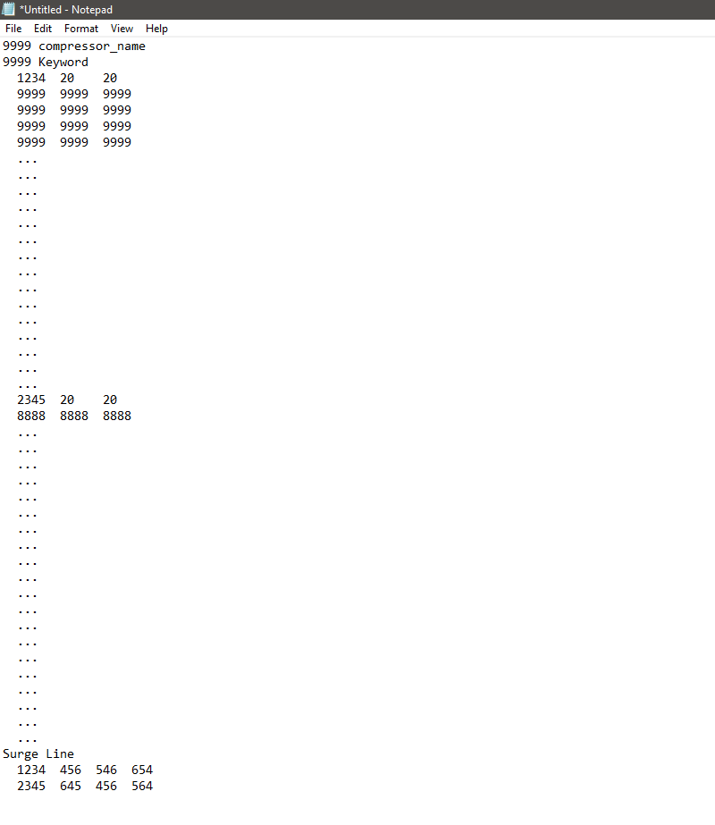
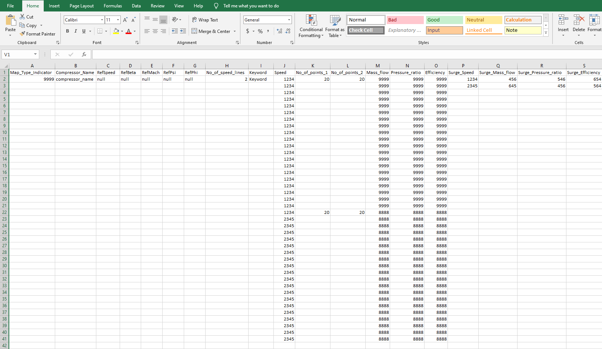

# Dataprocessing--Text-to-excel-data-
## Summary
This is python program to convert text data to excel sheet for compressor maps and later can be used to combine the parameters as an input for training the neural network for predicting the results.
The input is in the form of a text file as shown below:
## Note: Actual data is not shown in this text image. 

A sample text file is generated similar to  actual data with random data. These data's are sorted and restructured using a python program as shown below.

The compressor maps consists of several points and for each compresor maps it will vary ( This program works on specific sets of compressor map data). 
The future outlook is to retrieve the data in the form of an array ( pandas framework is usefull ) to keep  the values inside the program (parallely writing the excel file) and combine the parameters such as efficiency , pressure ratio...etc for the input. 
Later the input is fed to the neural network for training and final predictions can be achieved.

## Reference : https://www.gasturb.de/download.html (Smooth C user manual)
